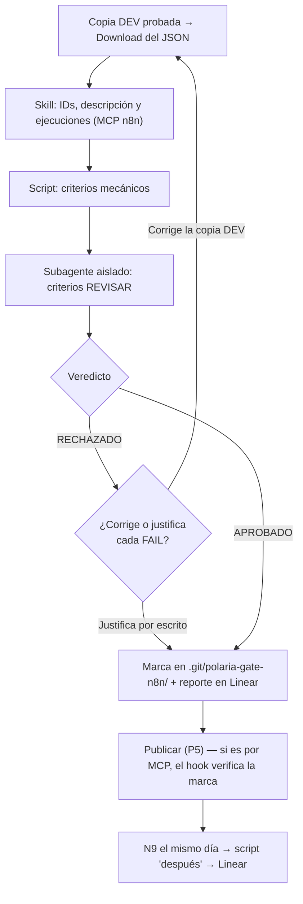

# GATE_DE_CALIDAD_N8N

*Polaria | Técnico*

## Glosario

| Término | Significado |
|---|---|
| Copia DEV | La copia de desarrollo de un workflow: mismo nombre que el de producción más ` - DEV`, tag `desarrollo`, nunca se publica (Estándares N8N, P5). |
| JSON descargado | El archivo que baja n8n desde el menú del workflow → **Download** (los Estándares lo llaman también "JSON exportado"). Es lo único que trae el pin data: el MCP de n8n no lo devuelve. |
| Veredicto | Resultado de la revisión: `APROBADO`, `RECHAZADO` o `RECHAZADO_JUSTIFICADO` (rechazado, pero quien construye justificó por escrito cada falla como falso positivo). |
| `versionId` / `activeVersionId` | Identificador de la versión guardada de un workflow / de la versión publicada. Los muestra el MCP de n8n. |
| Available in MCP | Ajuste de cada workflow (**Workflow Settings**) que deja al MCP de n8n leerlo. Viene apagado. |
| Skill / subagente / script / hook / MCP | Piezas del plugin, explicadas en la sección 3. |

## 1. Contexto

Aplica cada vez que alguien construye o cambia un workflow de n8n de Polaria, antes de publicarlo, incluidos los sub-workflows, el Error Handler y los issues Urgent. Existe porque la checklist de los Estándares N8N dependía de que quien la llenaba fuera honesto, y porque el plan Starter de n8n Cloud no tiene API ni auditoría de seguridad que revise un workflow antes de publicarlo. Reemplaza la excepción n8n que tenía el Gate de Calidad Técnica, que revisaba el JSON con criterios pensados para código.

## 2. Objetivo

Que ningún workflow llegue a producción sin que un script y un revisor de IA independiente hayan verificado los Criterios de aceptación de los Estándares N8N sobre la copia DEV, y que el JSON publicado quede en git el mismo día.

## 3. Cómo funciona (Pasos)

Todo lo ejecuta el plugin `gate-calidad-n8n`, instalado en el repo de cada proyecto n8n (el que tiene `workflows/`, `docs/` y `CHANGELOG.md`) desde el marketplace `PolariaTech/polaria-agent-plugins`. Tiene 5 piezas:

| Pieza | Qué hace |
|---|---|
| Skill `gate-calidad-n8n-polaria` | Coordina todo el flujo. No revisa el workflow. |
| Scripts `revisar-workflow.js` y `registrar-veredicto.js` | El primero revisa los criterios mecánicos sobre el JSON descargado y da siempre el mismo resultado para el mismo JSON. El segundo guarda el veredicto. Requieren Node.js. |
| Subagente `revisor-workflow-n8n` | Decide los criterios de juicio en un contexto aislado: no ve la conversación en la que se construyó el workflow. |
| Hook de `publish_workflow` | Bloquea que la IA publique por el MCP de n8n un workflow sin veredicto de las últimas 24 horas. |
| MCP de n8n y de Linear | n8n: IDs, descripción, ejecuciones y `activeVersionId`; el plugin trae el conector a la instancia de Polaria y cada persona lo autentica una vez con su cuenta de n8n. Linear: publica el reporte, siempre con confirmación. |

**Paso 0 — Arranque.** Quien construye dice algo como *"terminé el workflow, revísalo antes de publicar"* o *"¿puedo publicar esto?"*, y la skill se activa sola. Si pide publicar por el MCP sin pasar por el gate, el hook lo bloquea y eso activa la skill.

**Paso 1 — Insumos.** La copia DEV ya pasó sus pruebas y el `CHANGELOG.md` tiene la entrada del cambio con los casos probados (Paso 1 de los Estándares). Quien construye descarga su JSON (menú del workflow → **Download**) y le da la ruta a la skill. La skill obtiene del MCP de n8n el ID de `Polaria - Error Handler`, el ID del workflow de producción, la descripción de la copia DEV y sus ejecuciones manuales de las últimas 24 horas.

**Paso 2 — Revisión mecánica.** La skill corre el script sobre el JSON descargado. Cada criterio queda en `PASS`, `FAIL`, `N/A` o `REVISAR` (necesita juicio).

**Paso 3 — Revisión aislada.** El subagente recibe el JSON, la salida del script y el contexto, y decide cada `REVISAR`. Un `FAIL` del script no lo cambia. Devuelve la tabla completa de criterios, el Veredicto Final y cómo corregir cada `FAIL`, que la skill muestra sin cambios.

**Paso 4 — Veredicto.** La skill lo registra en `.git/polaria-gate-n8n/<ID del workflow de producción>.md` (dentro de `.git/`, nunca se sube al repo) y publica el reporte en el issue de Linear, sea cual sea el veredicto:

| Veredicto | Qué pasa |
|---|---|
| `APROBADO` | Se puede publicar. |
| `RECHAZADO` | Quien construye corrige la copia DEV, la descarga de nuevo y vuelve al paso 1. |
| `RECHAZADO_JUSTIFICADO` | Quien construye justificó por escrito cada `FAIL` como falso positivo. Se puede publicar, y la justificación va junto al reporte en Linear. |

**Paso 5 — Publicar.** Quien construye importa el JSON de la copia DEV en el workflow de producción, verifica las credenciales de cada nodo y publica (P5 de los Estándares). La copia DEV nunca se publica. Si la publicación la hace la IA por el MCP, el hook verifica el veredicto antes.

**Paso 6 — Git, el mismo día.** Quien construye aplica N9 (JSON en `workflows/`, commit y `versionId` en la entrada del `CHANGELOG.md`). La skill corre el script en modo "después de publicar" con el `activeVersionId` que da el MCP y agrega el resultado del criterio 23 al issue de Linear.

## 4. Reglas

| Regla | Por qué existe |
|---|---|
| Todo workflow pasa por este gate antes de publicarse, sin excepción, incluidos los issues Urgent. | La revisión toma minutos; eximir al cambio hecho con más presión lo deja sin ningún control. |
| Los criterios de juicio los decide el subagente aislado, nunca la sesión de IA que construyó el workflow. | Una IA revisando su propio trabajo comparte los supuestos que produjeron el defecto. |
| No se publica con `RECHAZADO` sin corregir o justificar por escrito cada `FAIL`. | Publicar algo que nace rechazado vuelve inútil la revisión. |
| El reporte completo (no solo el veredicto) queda en el issue de Linear antes de publicar. | Es la única evidencia cuando se publica desde la interfaz de n8n, que el hook no ve. |
| La copia DEV y el workflow de producción tienen activado **Available in MCP**. | Sin eso la skill no puede leer IDs, ejecuciones ni la versión publicada, y hay que copiarlos a mano. |

## 5. Excepciones

| Situación | Qué hacer |
|---|---|
| Primera publicación: el workflow de producción todavía no existe | Quien construye lo crea importando el JSON de la copia DEV, sin publicarlo, y le da su ID a la skill para registrar el veredicto. |
| Un workflow no tiene activado Available in MCP y quien construye no puede activarlo | Quien construye le da a la skill los IDs y el `activeVersionId` desde la interfaz de n8n; el reporte lo declara. |
| La IA no está disponible | Quien construye escala al Responsable Técnico, quien decide si otra persona revisa con los Criterios de aceptación o se espera. |
| El entorno no soporta subagentes | La skill lanza un agente genérico con las instrucciones del revisor; si tampoco se puede, revisa ella misma y lo declara en el reporte ("Revisión sin aislamiento"). |
| Quien construye no está de acuerdo con un `FAIL` | Lo justifica por escrito (queda `RECHAZADO_JUSTIFICADO`). Si la duda es real, consulta al Responsable Técnico antes de decidir solo. |
| Se publica desde la interfaz de n8n | El hook no lo ve. La regla sigue aplicando y la falta del reporte en Linear lo hace visible. |

## 6. Criterios

Los criterios son los Criterios de aceptación de los Estándares de Diseño de Workflows N8N v2.1 (22 antes de publicar, 1 después). El reparto vive en el script `revisar-workflow.js`: marca cada criterio en `PASS`, `FAIL`, `N/A` o `REVISAR`, y el subagente `revisor-workflow-n8n` decide solo los `REVISAR`. **Veredicto `APROBADO` solo si ningún criterio queda en `FAIL`**; un `N/A` nunca cuenta como `FAIL`.

## 7. Dependencias

| Protocolo | Relación |
|---|---|
| Estándares de Diseño de Workflows N8N v2.1 | Define las reglas y los Criterios de aceptación que este gate evalúa; sus Pasos 2 y 3 son este gate. |
| Gate de Calidad Técnica Pre-Merge | Cubre el código. Los workflows n8n pasan por este gate, no por el técnico. |
| Protocolo de Construcción de Producto desde Cero | Habilita este plugin en todo proyecto n8n nuevo. |
| Protocolo de Auditoría Técnica | La auditoría detecta y revalida; la corrección de un hallazgo en un workflow pasa por este gate. |

## 8. Rollback

Si un workflow ya publicado falla, se vuelve a publicar la versión anterior desde el historial de n8n o importando el JSON anterior de `workflows/`, se registra en `CHANGELOG.md` con su `versionId` y la corrección pasa de nuevo por este gate.

## 9. Métricas de éxito

| Métrica | Meta |
|---|---|
| Publicaciones con el reporte completo en Linear | 100 % |
| Publicaciones con `RECHAZADO` sin justificación | 0 |
| Publicaciones con el criterio 23 en `PASS` el mismo día | 100 % |

## Versión y revisión

v1.0 · aprobado el 24/09/2026 · Responsable Técnico · próxima revisión: tras las primeras 5 publicaciones con el gate, al cambiar de plan o de hosting de n8n, o a los 6 meses de aprobado.
