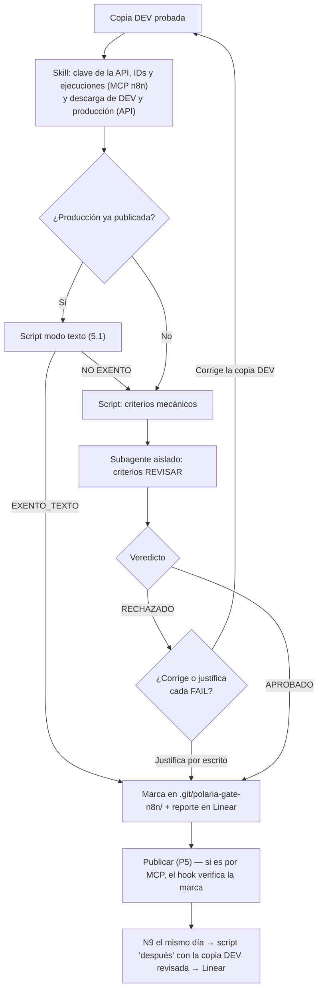

# GATE DE CALIDAD N8N

*Polaria | Técnico*

| Versión | Creado por | Aprobado por | Fecha |
|---|---|---|---|
| v1.1 | Responsable Metodología | Responsable Metodología | 06/10/2026 |

## Glosario

| Término | Significado |
|---|---|
| Copia DEV | La copia de desarrollo de un workflow: mismo nombre que el de producción más ` - DEV`, tag `desarrollo`, nunca se publica (Estándares N8N, P5). |
| JSON descargado | El JSON completo de un workflow, con su pin data. Lo baja el script `descargar-workflow.js` por la API de n8n, o quien construye desde el menú del workflow → **Download** (los Estándares lo llaman también "JSON exportado"). El MCP de n8n no sirve para esto: no devuelve el pin data. |
| API de n8n | API pública de la instancia (**Settings → n8n API**). Cada persona crea su propia clave con el scope `workflow:read` y la guarda en la variable de entorno `N8N_API_KEY` de su máquina. |
| Veredicto | Resultado de la revisión: `APROBADO`, `RECHAZADO`, `RECHAZADO_JUSTIFICADO` (rechazado, pero quien construye justificó por escrito cada falla como falso positivo) o `EXENTO_TEXTO` (el script demostró que el cambio es de solo texto, sección 5.1). |
| `versionId` / `activeVersionId` | Identificador de la versión guardada de un workflow / de la versión publicada. Los muestra el MCP de n8n. |
| Available in MCP | Ajuste de cada workflow (**Workflow Settings**) que deja al MCP de n8n leerlo. Viene apagado. |
| Skill / subagente / script / hook / MCP | Piezas del plugin, explicadas en la sección 3. |

## 1. Contexto

Aplica cada vez que alguien construye o cambia un workflow de n8n de Polaria, antes de publicarlo, incluidos los sub-workflows, el Error Handler y los issues Urgent. Existe porque la checklist de los Estándares N8N dependía de que quien la llenaba fuera honesto, y porque n8n Cloud no tiene una auditoría de seguridad que revise un workflow antes de publicarlo. Reemplaza la excepción n8n que tenía el Gate de Calidad Técnica, que revisaba el JSON con criterios pensados para código.

La v1.0 trataba igual todos los cambios: corregir una tilde costaba lo mismo que agregar un nodo (en POL-294, 3 Gates completos por 13 cadenas de texto). La v1.1 exime el cambio de solo texto, pero la exención la decide un script, nunca quien construye, porque hay textos que son contrato: otro nodo los compara para decidir. También descarga los workflows por la API de n8n, que el plan contratado sí tiene, en vez de depender del Download manual.

## 2. Objetivo

Que ningún workflow llegue a producción sin que un script y un revisor de IA independiente hayan verificado los Criterios de aceptación de los Estándares N8N sobre la copia DEV (o sin que el script haya demostrado que el cambio es de solo texto), que lo publicado sea lo que se revisó, y que el JSON publicado quede en git el mismo día.

## 3. Cómo funciona (Pasos)

Todo lo ejecuta el plugin `gate-calidad-n8n`, instalado en el repo de cada proyecto n8n (el que tiene `workflows/`, `docs/` y `CHANGELOG.md`) desde el marketplace `PolariaTech/polaria-agent-plugins`. Tiene 5 piezas:

| Pieza | Qué hace |
|---|---|
| Skill `gate-calidad-n8n-polaria` | Coordina todo el flujo. No revisa el workflow. |
| Scripts `descargar-workflow.js`, `revisar-workflow.js` y `registrar-veredicto.js` | El primero descarga el JSON completo por la API de n8n. El segundo revisa los criterios mecánicos y, en modo `texto`, decide si el cambio es de solo texto; da siempre el mismo resultado para el mismo JSON. El tercero guarda el veredicto. Requieren Node.js. |
| Subagente `revisor-workflow-n8n` | Decide los criterios de juicio en un contexto aislado: no ve la conversación en la que se construyó el workflow. |
| Hook de `publish_workflow` | Bloquea que la IA publique por el MCP de n8n un workflow sin veredicto de las últimas 24 horas y, si quien publica tiene la clave de la API, uno cuya copia DEV cambió después del veredicto. |
| MCP de n8n y de Linear | n8n: IDs, descripción, ejecuciones y `activeVersionId`; el plugin trae el conector a la instancia de Polaria y cada persona lo autentica una vez con su cuenta de n8n. Linear: publica el reporte, siempre con confirmación. |

**Paso 0 — Arranque.** Quien construye dice algo como *"terminé el workflow, revísalo antes de publicar"* o *"¿puedo publicar esto?"*, y la skill se activa sola. Si pide publicar por el MCP sin pasar por el gate, el hook lo bloquea y eso activa la skill. Lo primero que hace la skill es comprobar la clave de la API de n8n; si falta, muestra cómo crearla y guardarla, y espera.

**Paso 1 — Insumos.** La copia DEV ya pasó sus pruebas y el `CHANGELOG.md` tiene la entrada del cambio con los casos probados (Paso 1 de los Estándares). La skill obtiene del MCP de n8n el ID de `Polaria - Error Handler`, los IDs de la copia DEV y del workflow de producción, el `activeVersionId` de producción, la descripción de la copia DEV y sus ejecuciones manuales de las últimas 24 horas, y descarga por la API el JSON de la copia DEV y, si producción está publicada, el de producción.

**Paso 1b — Verificación de cambio de solo texto.** Si producción ya está publicada, la skill corre el script en modo `texto`, que compara la copia DEV con producción. Si demuestra que el cambio es de solo texto (sección 5.1), registra él mismo el veredicto `EXENTO_TEXTO`, la skill publica su salida en el issue de Linear y se salta al Paso 5. Si no, se sigue con el Paso 2.

**Paso 2 — Revisión mecánica.** La skill corre el script sobre el JSON de la copia DEV. Cada criterio queda en `PASS`, `FAIL`, `N/A` o `REVISAR` (necesita juicio).

**Paso 3 — Revisión aislada.** El subagente recibe el JSON, la salida del script y el contexto, y decide cada `REVISAR`. Un `FAIL` del script no lo cambia. Devuelve la tabla completa de criterios, el Veredicto Final y cómo corregir cada `FAIL`, que la skill muestra sin cambios.

**Paso 4 — Veredicto.** La skill lo registra en `.git/polaria-gate-n8n/<ID del workflow de producción>.md` (dentro de `.git/`, nunca se sube al repo) junto con el `versionId` y el ID de la copia DEV revisada, y publica el reporte en el issue de Linear, sea cual sea el veredicto:

| Veredicto | Qué pasa |
|---|---|
| `APROBADO` | Se puede publicar. |
| `RECHAZADO` | Quien construye corrige la copia DEV y se vuelve al paso 1. |
| `RECHAZADO_JUSTIFICADO` | Quien construye justificó por escrito cada `FAIL` como falso positivo. Se puede publicar, y la justificación va junto al reporte en Linear. |
| `EXENTO_TEXTO` | Lo registra solo el script del Paso 1b. Se puede publicar, y su salida es el reporte en Linear. |

**Paso 5 — Publicar.** Quien construye importa el JSON de la copia DEV en el workflow de producción, verifica las credenciales de cada nodo y publica (P5 de los Estándares). La copia DEV nunca se publica. Si la publicación la hace la IA por el MCP, el hook verifica el veredicto antes y, si quien publica tiene la clave de la API, que la copia DEV sigue siendo la revisada.

**Paso 6 — Git, el mismo día.** Quien construye aplica N9 (JSON en `workflows/`, commit y `versionId` en la entrada del `CHANGELOG.md`). La skill corre el script en modo "después de publicar" con el `activeVersionId` que da el MCP y el JSON de la copia DEV revisada: el criterio 23 falla también si lo publicado no es lo que se revisó. El resultado va al issue de Linear.

## 4. Reglas

| Regla | Por qué existe |
|---|---|
| Todo workflow pasa por este gate antes de publicarse, sin excepción, incluidos los issues Urgent; un cambio de solo texto demostrado por el script (5.1) se resuelve en el Paso 1b, sin los Pasos 2 a 4. | La revisión toma minutos; eximir al cambio hecho con más presión lo deja sin ningún control. |
| La exención de solo texto la decide el script, nunca quien construye ni la sesión de IA que construyó el workflow. Nadie tiene que declarar que el cambio "es solo texto": el script corre siempre. | "Es solo texto" es la autoevaluación que el gate existe para evitar; hay textos que otro nodo compara para decidir. |
| Los criterios de juicio los decide el subagente aislado, nunca la sesión de IA que construyó el workflow. | Una IA revisando su propio trabajo comparte los supuestos que produjeron el defecto. |
| No se publica con `RECHAZADO` sin corregir o justificar por escrito cada `FAIL`. | Publicar algo que nace rechazado vuelve inútil la revisión. |
| El reporte completo (no solo el veredicto) queda en el issue de Linear antes de publicar; en `EXENTO_TEXTO`, la salida completa del script. | Es la única evidencia cuando se publica desde la interfaz de n8n, que el hook no ve. |
| La clave de la API de n8n es personal, tiene solo el scope `workflow:read`, vence a los 90 días y vive solo en la variable de entorno `N8N_API_KEY`: nunca en el repo, en Linear ni en el chat. | Con solo lectura, una clave filtrada no puede cambiar, publicar ni borrar workflows. |
| La copia DEV y el workflow de producción tienen activado **Available in MCP**. | Sin eso la skill no puede leer IDs, ejecuciones ni la versión publicada, y hay que copiarlos a mano. |

## 5. Excepciones

| Situación | Qué hacer |
|---|---|
| El cambio solo modifica textos literales (avisos, mensajes, notas), sin tocar lógica, prompts ni contratos | No hace falta el revisor aislado si el script en modo `texto` lo demuestra (5.1). Si encuentra una sola diferencia que no sea texto permitido, no hay exención y se siguen los Pasos 2 a 4. |
| Primera publicación: el workflow de producción todavía no existe | Quien construye lo crea importando el JSON de la copia DEV, sin publicarlo, y le da su ID a la skill para registrar el veredicto. No aplica la exención de solo texto. |
| Quien construye no puede crear la clave de la API, o la API no responde | Descarga el JSON a mano (menú del workflow → **Download**) y le da la ruta a la skill; como base de comparación del Paso 1b se usa `workflows/<archivo>.json` de git. El reporte lo declara. |
| Un workflow no tiene activado Available in MCP y quien construye no puede activarlo | Quien construye le da a la skill los IDs y el `activeVersionId` desde la interfaz de n8n; el reporte lo declara. |
| La IA no está disponible | Quien construye escala al Responsable Técnico, quien decide si otra persona revisa con los Criterios de aceptación o se espera. |
| El entorno no soporta subagentes | La skill lanza un agente genérico con las instrucciones del revisor; si tampoco se puede, revisa ella misma y lo declara en el reporte ("Revisión sin aislamiento"). |
| Quien construye no está de acuerdo con un `FAIL` | Lo justifica por escrito (queda `RECHAZADO_JUSTIFICADO`). Si la duda es real, consulta al Responsable Técnico antes de decidir solo. |
| Se publica desde la interfaz de n8n | El hook no lo ve. La regla sigue aplicando, la falta del reporte en Linear lo hace visible y el criterio 23 detecta si lo publicado no es lo revisado. |

### 5.1 Cambio de solo texto: qué califica

El script compara la copia DEV contra la versión publicada de producción. Antes exige que esa base sea realmente la publicada: su `versionId` tiene que coincidir con el `activeVersionId` que da el MCP. Es exento solo si se cumplen **todas** estas condiciones:

1. **Estructura idéntica:** los mismos nodos (nombre, type, typeVersion), las mismas conexiones, las mismas credenciales, los mismos settings y la misma configuración de error por nodo (`onError`, `retryOnFail`, `maxTries`, `alwaysOutputData`). No cuentan la posición en el canvas, el nombre y los tags del workflow, el `versionId`, la descripción, el id interno de cada nodo (n8n lo genera en cada copia; las conexiones usan el nombre) ni el pin data (es de la copia DEV y no llega a producción), aunque un pin data con forma de clave impide la exención.
2. **Toda diferencia está en una ubicación permitida:** el valor de una asignación de tipo string de un nodo Edit Fields que no empiece con `=` (las expresiones quedan fuera: ahí cambiar texto puede cambiar la lógica), el contenido de una nota adhesiva o la nota de un nodo.
3. **Es texto para personas** (valores de Edit Fields): el valor anterior y el nuevo tienen al menos un espacio y no tienen forma de correo, número, JSON ni ID, ni contienen una URL. En cualquier ubicación, un texto nuevo con forma de clave, o que agrega un correo o teléfono, no califica (criterio 12).
4. **No es un código:** no cambian los campos `code`, `ok`, `retryable`, `schema_version`, `status`, `intent` ni `type`, ni un valor en `UPPER_SNAKE_CASE`. Los códigos son contrato entre workflows.
5. **No es parte de un prompt:** el Edit Fields no está conectado directamente a un nodo de IA, y ningún nodo de IA lee el campo cambiado. (Los Estándares piden que cada agente tenga su Edit Fields preparador, así que ahí suele vivir el texto que lee un modelo.)
6. **Ningún texto viejo es un contrato:** el valor anterior no aparece, sin importar mayúsculas ni acentos, en ninguna condición, expresión, código, prompt o query del mismo workflow ni de los demás workflows de `workflows/` del repo; y ningún texto de 8 caracteres o más de esos lugares aparece dentro del valor anterior (atrapa comparaciones parciales como `.includes('No encontre informacion')`). Sin `workflows/` no hay exención.
7. **Las diferencias propias de la copia DEV se declaran:** cuando la copia DEV apunta a otra copia DEV (el `workflowId` de un `executeWorkflow` o `toolWorkflow`), la skill declara la pareja `<ID de producción>=<ID de la copia DEV>` después de comprobar en n8n que sus nombres corresponden. Solo se toleran en ese `workflowId`, con forma de ID de n8n, y el reporte las lista.

Siempre quedan fuera de la exención: prompts de agentes, descripciones de tools, consultas SQL, código de nodos Code, URLs y nombres de nodos (otros nodos los referencian con `$('...')`). Un consumidor fuera de n8n (por ejemplo, un frontend que compara un mensaje) el script no lo ve: si existe, el texto se trata como código y se siguen los Pasos 2 a 4.

Aunque esté exento, sigue siendo obligatorio:

| Requisito | Por qué no se exime |
|---|---|
| Copia DEV y JSON descargados (no armados desde el MCP) | El script necesita el JSON real. |
| Entrada en el `CHANGELOG.md` (PATCH) | Trazabilidad del cambio. |
| Salida completa del script en el issue de Linear | Es la evidencia que reemplaza al reporte del revisor y hace visible la exención. |
| Paso 6 el mismo día, con el criterio 23 comparando lo publicado contra la copia DEV verificada (salvo las credenciales, que P5 cambia a las de producción) | Demuestra que se publicó lo que se verificó, y deja en git la base de la próxima comparación. |

Lo que se omite: el subagente revisor, los 22 criterios "antes de publicar" y el caso de error ejecutado del criterio 14 (pide probar la lógica, y el script ya demostró que la lógica no cambió).

## 6. Criterios

Los criterios son los Criterios de aceptación de los Estándares de Diseño de Workflows N8N v2.2 (22 antes de publicar, 1 después). El reparto vive en el script `revisar-workflow.js`: marca cada criterio en `PASS`, `FAIL`, `N/A` o `REVISAR`, y el subagente `revisor-workflow-n8n` decide solo los `REVISAR`. **Veredicto `APROBADO` solo si ningún criterio queda en `FAIL`**; un `N/A` nunca cuenta como `FAIL`. Las condiciones de `EXENTO_TEXTO` son las de la sección 5.1, y también las aplica el script.

## 7. Dependencias

| Protocolo | Relación |
|---|---|
| Estándares de Diseño de Workflows N8N v2.2 | Define las reglas y los Criterios de aceptación que este gate evalúa; sus Pasos 2 y 3 son este gate. |
| Gate de Calidad Técnica Pre-Merge | Cubre el código. Los workflows n8n pasan por este gate, no por el técnico. |
| Protocolo de Construcción de Producto desde Cero | Habilita este plugin en todo proyecto n8n nuevo. |
| Protocolo de Auditoría Técnica | La auditoría detecta y revalida; la corrección de un hallazgo en un workflow pasa por este gate. |

## 8. Rollback

Si un workflow ya publicado falla, se vuelve a publicar la versión anterior desde el historial de n8n o importando el JSON anterior de `workflows/`, se registra en `CHANGELOG.md` con su `versionId` y la corrección pasa de nuevo por este gate. Si lo que falló había pasado como `EXENTO_TEXTO`, se agrega al issue qué no detectó el script, para corregir la sección 5.1 y el script.

## 9. Métricas de éxito

| Métrica | Meta |
|---|---|
| Publicaciones con el reporte completo (o la salida del modo `texto`) en Linear | 100 % |
| Publicaciones con `RECHAZADO` sin justificación | 0 |
| Publicaciones con el criterio 23 en `PASS` el mismo día | 100 % |
| Publicaciones `EXENTO_TEXTO` que después necesitaron rollback | 0 |
