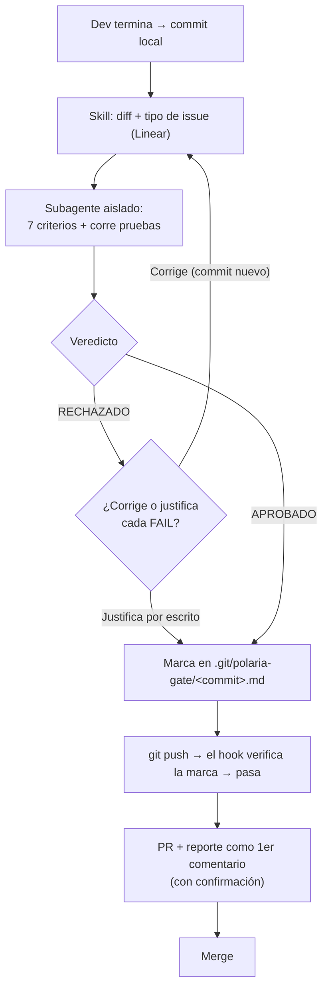

# GATE_DE_CALIDAD_TECNICA_PRE_MERGE

*(antes "Revisión de Pares" — renombrado el 22/09/2026 porque el revisor real es una IA actuando como "segundo par", no un dev humano)*

*Polaria | Técnico*

## Glosario

| Término | Significado |
|---|---|
| Diff | La lista exacta de líneas que cambiaron entre la rama del dev y la rama principal (`+` agregadas, `-` quitadas). Es lo único que se revisa. |
| Commit / push / PR | Commit: guardar el cambio en la máquina del dev. Push: subirlo a GitHub. PR (Pull Request): pedir que se mezcle con la rama principal. |
| Veredicto | Resultado de la revisión: `APROBADO`, `RECHAZADO` o `RECHAZADO_JUSTIFICADO` (rechazado, pero el dev justificó por escrito cada falla como falso positivo). |
| CI / staging | CI: servidor que corre las pruebas automáticamente al subir código (ej. GitHub Actions). Staging: entorno de pruebas que imita producción. Su "salida" es el resultado impreso de las pruebas (ej. "42 pasaron, 0 fallaron"). |
| Skill / subagente / hook / MCP | Piezas del plugin, explicadas en la sección 3. |

## 1. Contexto

Aplica cada vez que un dev termina un cambio de código (Bug, Feature o Improvement), **antes de hacer `push`**. Existe porque la validación de "Done" (Metodología de Trabajo v1.2, sección 7) confirma que el comportamiento funciona, pero no revisa la calidad técnica del código: nombres, manejo de errores, credenciales, código de debug ni pruebas. También es el gate por el que pasa la corrección de todo hallazgo del Protocolo de Auditoría Técnica, que detecta y revalida pero no corrige.

## 2. Objetivo

Que ningún cambio llegue a GitHub sin que un revisor de IA independiente haya revisado su calidad técnica y ejecutado sus pruebas, sin depender de que otro dev esté disponible en un equipo de 3.

## 3. Cómo funciona (Pasos)

Todo lo ejecuta el plugin `gate-calidad-tecnica`, instalado en cada repo de código desde el marketplace `PolariaTech/polaria-agent-plugins` (Claude Code y Cursor). Tiene 4 piezas:

| Pieza | Qué hace |
|---|---|
| Skill `gate-calidad-tecnica-pre-merge-polaria` | Coordina todo el flujo. No revisa el código. |
| Subagente `revisor-tecnico-pre-merge` | Revisa el diff en un contexto aislado: no ve la conversación en la que se escribió el código. Solo lee y ejecuta pruebas. |
| Hook de `git push` | Bloquea el `push` que ejecuta la IA si ese commit no tiene veredicto. Si el hook falla, también bloquea en vez de dejar pasar. Requiere Node.js en la máquina del dev. |
| Hook `pre-push` de git | Lo instala el plugin en el repo al abrir cada sesión. Bloquea el `push` sin veredicto venga de donde venga: la IA, la terminal o el panel de Git del editor. |
| MCP de Linear y GitHub | Lee el tipo de issue y publica el reporte, siempre con confirmación del dev. |

**Paso 0 — Arranque.** El dev dice algo como *"terminé, revísalo antes de hacer push"* o *"¿puedo subir esto?"*, y la skill se activa sola. Si el dev pide el `push` sin pasar por el gate, el hook lo bloquea y eso activa la skill.

**Paso 1 — Previo.** La skill confirma que hay commits locales contra la rama principal. Si hay cambios sin commit, pide al dev hacer un commit local primero: el veredicto queda atado a ese commit, y si el código cambia después hay que revisarlo de nuevo.

**Paso 2 — Diff y contexto.** La skill obtiene el diff (`git diff <principal>...HEAD`) y el tipo de cambio: lo lee de Linear si la rama o el commit citan `POL-XX`, o se lo pregunta al dev. Si el tipo es Bug, se exige test de regresión. Si el diff está vacío, responde `ERROR: No se detectó un diff de código válido para auditar en Polaria.` y se detiene.

**Paso 3 — Revisión aislada.** El subagente recibe solo el diff y el contexto, aplica los 7 criterios (sección 6) y **corre las pruebas él mismo**. Devuelve una tabla con los 7 criterios, el Veredicto Final y, debajo, cómo corregir cada `FAIL` (archivo, línea y qué cambiar). La skill lo muestra al dev en el chat sin cambios. El revisor solo sugiere: el dev decide y aplica la corrección.

**Paso 4 — Veredicto.** La skill lo registra con un solo comando, que escribe una marca dentro de `.git/` (nunca se sube al repo ni se ve en el proyecto). El gate no crea ningún otro archivo: el reporte vive en el chat y después en el PR/Linear.

| Veredicto | Qué pasa |
|---|---|
| `APROBADO` | El dev puede hacer `push`. |
| `RECHAZADO` | El dev corrige, hace un commit nuevo y vuelve al paso 1. El `push` queda bloqueado. |
| `RECHAZADO_JUSTIFICADO` | El dev justificó por escrito cada `FAIL` como falso positivo. Puede hacer `push`, y la justificación va junto al reporte en el PR/Linear. |

**Paso 5 — Push.** El dev pide el `push` después de ver el reporte; la IA no lo hace por su cuenta, aunque se lo hayan pedido antes del gate. Al ejecutar `git push`, los hooks revisan el veredicto del commit: si es `APROBADO` o `RECHAZADO_JUSTIFICADO`, dejan pasar; si no existe o es de un commit anterior, bloquean.

**Paso 6 — PR y evidencia.** La skill ofrece abrir el PR y publicar el reporte completo como primer comentario del PR y/o en el issue de Linear. Siempre pide confirmación antes.

**Paso 7 — Merge.** Con el reporte publicado, el dev mergea.

## 4. Reglas

| Regla | Por qué existe |
|---|---|
| Todo cambio pasa por este gate antes del `push`, sin excepción — incluidos los issues Urgent | El SLA de Urgent es 24 horas y la revisión toma minutos. Eximir justo al código hecho bajo más presión lo dejaría sin ningún control técnico. |
| La revisión la hace el subagente aislado, nunca la misma sesión de IA que escribió el código | Una IA revisando su propio código comparte los supuestos que produjeron el defecto: eso es auto-revisión, no un segundo par. |
| No se hace `push` con `RECHAZADO` sin corregir o justificar por escrito cada `FAIL` | Publicar una rama que nace rechazada genera ruido al equipo y vuelve inútil la revisión. |
| El reporte completo (no solo el veredicto) queda en el PR o en Linear | Sin el detalle por criterio no hay forma de auditar qué se revisó realmente. |

## 5. Excepciones

| Situación | Qué hacer |
|---|---|
| La IA no está disponible | El dev escala al Responsable, quien decide si otro dev revisa manualmente o se espera. |
| El entorno no soporta subagentes | La skill lanza un agente genérico con las instrucciones del revisor; si tampoco se puede, revisa ella misma y lo declara en el reporte ("Revisión sin aislamiento"). |
| El dev no está de acuerdo con un `FAIL` | Lo justifica por escrito (queda `RECHAZADO_JUSTIFICADO`). Si la duda es real, consulta al Responsable antes de decidir solo. |
| Las pruebas no se pueden correr en la máquina del dev (necesitan servicios o credenciales que no tiene) | El dev pega la salida real de CI o staging. Sin ninguna salida real, el criterio 6 es `FAIL`. |
| El repo ya tiene su propio `pre-push` o usa `core.hooksPath` (por ejemplo, husky) | El plugin no lo pisa y avisa al abrir la sesión. El dev agrega al `pre-push` existente la línea que indica el aviso. Hasta hacerlo, el `push` desde la terminal no se bloquea, y la falta del reporte en el PR lo hace visible. |
| El dev hace el `push` con `--no-verify` | Salta el `pre-push`. Incumple el protocolo, y la falta del reporte en el PR lo hace visible. |

## 6. Los 7 criterios

La definición completa (rol, formato de salida, ejemplo) vive en el subagente `revisor-tecnico-pre-merge` del plugin. **Veredicto `APROBADO` solo si ningún criterio queda en `FAIL`**; un `N/A` nunca cuenta como `FAIL`.

| # | Criterio | `FAIL` si… |
|---|---|---|
| 1 | Nomenclatura | Hay variables ambiguas (`x`, `temp`, `data2`). |
| 2 | Manejo de errores | Una llamada a API, query o parsing no tiene manejo de errores explícito. |
| 3 | Secretos | Hay API keys, tokens, contraseñas o credenciales en el código. |
| 4 | Código de debug | Quedan `console.log`, `print`, `TODO borrar` o código muerto. |
| 5 | Convenciones Polaria | El estilo no es consistente con el lenguaje del diff. |
| 6 | Pruebas | No hay pruebas que cubran el cambio; es un Bug y no trae su test de regresión; no hay salida real de la ejecución; o alguna prueba falla. Mencionar pruebas no basta. Si el cambio no es automatizable, vale una prueba manual documentada con pasos y resultado. |
| 7 | Validación de formularios (`N/A` si el diff no toca un formulario) | Falta algo de lo que exige `PROTOCOLO_DE_VALIDACION_DE_FORMULARIOS_v1.1.md` para las capas que viven en este repo, con la librería que use el repo: el schema completo (`schemas/schema_<formulario>.md` de este repo; si no está, del repo de flujos u otro repo del workspace; o el issue de Linear), los niveles por campo, las pruebas por campo, su ejecución o el checklist de prueba manual en PASS. |

## 7. Dependencias

- **Protocolo de Auditoría Técnica v1.2:** la auditoría no corrige; cada corrección de un hallazgo pasa por este gate, y después la auditoría la revalida.
- **Protocolo de Versionamiento (sección 3.1):** el criterio 6 revisa un cambio a la vez; no reemplaza el mínimo de pruebas por versión (Major/Minor/Patch) que ese protocolo exige al consolidar la versión.
- **Validación de "Done" (Metodología de Trabajo v1.2, sección 7):** sigue siendo necesaria; este gate cubre la calidad técnica, Done cubre el comportamiento funcional.

## 8. Rollback

Si un cambio ya mergeado tiene un problema, se revierte y se genera una versión PATCH nueva, como exige el Protocolo de Versionamiento ("una versión desplegada no se modifica").

## 9. Métricas de éxito

| Métrica | Meta |
|---|---|
| PRs mergeados con el reporte completo en el PR o en Linear | 100% |
| PRs mergeados con `RECHAZADO` sin justificación | 0 |
| Bugs que reaparecen después de corregidos | 0 |

## Versión y revisión

v1.2 · aprobado 22/09/2026 · Responsable Técnico · próxima revisión: tras cada ejecución real del protocolo, o si el equipo de dev crece más allá de 3 personas

_Historial: v1.0 (13/09/2026) "Revisión de Pares", un prompt que el dev pegaba a mano. v1.1 (22/09/2026): la revisión pasa a antes del `push`. v1.2 (22/09/2026): revisor aislado (subagente), plugin con hook que bloquea el `push` sin veredicto en Claude Code y Cursor, y criterio 6 con test de regresión por Bug y ejecución real de pruebas (regla que antes vivía en el Protocolo de Auditoría Técnica). Ajuste del 23/09/2026 (plugin 1.2.1): el criterio 7 verifica contra el schema del formulario que vive en el repo y sirve para cualquier stack, alineado con Validación de Formularios v1.1. Ajuste del 24/09/2026 (plugin 1.3.0): un `push` hecho en Cursor pasó sin veredicto porque el hook dejaba pasar cuando fallaba; ahora bloquea si falla, el plugin instala además un `pre-push` de git que cubre la terminal y el panel de Git, y la IA no hace el `push` sin que el dev lo pida después del reporte. Ajuste del 24/09/2026 (plugin 1.4.0): el reporte trae cómo corregir cada `FAIL`, el schema se busca también en el repo de flujos u otro repo del workspace, y el veredicto se registra con un comando sin crear archivos en el proyecto. Ajuste del 24/09/2026 (plugin 1.4.1): los workflows n8n salen de este gate y pasan al Gate de Calidad N8N v1.0. Ajuste del 25/09/2026 (plugin 1.4.3): en Cursor el hook nunca verificó nada, porque Cursor manda el evento con un BOM delante del JSON y el script lo tomaba como ilegible; por lo mismo el pre-push de git no se instalaba. Ahora ambos scripts quitan el BOM, y el pre-push vuelve a ser la barrera ante cualquier falla del hook. Pendiente republicar en Drive — hoy solo está publicado como `REVISION_DE_PARES_v1.0`._
