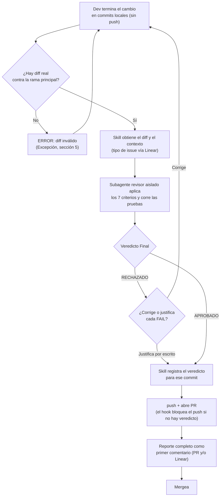

# GATE_DE_CALIDAD_TECNICA_PRE_MERGE

*(antes "Revisión de Pares" — renombrado el 22/09/2026 porque el mecanismo real es una IA actuando como el "segundo par", no un dev humano; ver sección 2)*

*Polaria | Técnico*

## 1. Contexto

Aplica cada vez que un dev completa un cambio de código (Bug, Feature o Improvement), **antes de hacer `push`/abrir PR en GitHub** — no después. Existe porque la validación cruzada de "Done" (Metodología de Trabajo v1.2 sección 7) confirma que el comportamiento funciona, pero no revisa nomenclatura, manejo de errores, credenciales hardcodeadas, pruebas ni deuda técnica — brecha detectada en la auditoría de metodología de agosto 2026 (la carpeta `04_DESARROLLO_Y_CODIGO/03_REVISION_DE_PARES` existía en el Drive sin protocolo asociado).

También es el gate por el que pasa la corrección de todo hallazgo confirmado por el Protocolo de Auditoría Técnica: la auditoría detecta y revalida, pero no corrige ni escribe pruebas. Aquí se exigen las pruebas de la corrección, incluido el test de regresión propio cuando el hallazgo es un Bug (criterio 6).

## 2. Objetivo

Evitar que código con problemas técnicos llegue a producción, usando un revisor de IA independiente como el "segundo par" de revisión técnica sobre el diff local, antes de publicar la rama — sin depender de que otro dev humano esté disponible en un equipo de 3 devs.

## 3. Pasos

Resumen del flujo — el detalle ejecutable completo vive en el plugin `gate-calidad-tecnica` (carpeta `skill/`), no aquí.

1. Dev autor termina el cambio y lo deja en uno o varios commits locales (sin hacer `push` todavía). Le pide a su asistente de IA (Cursor/Claude) que lo revise en lenguaje natural (ej. *"terminé este cambio, revísalo antes de hacer push"*); si el plugin está instalado en el repo, se activa solo. El revisor es un subagente aislado que solo ve el diff y su contexto, nunca la conversación en la que se escribió el código.
2. **Si `APROBADO`:** hace `push`, abre el PR, y el reporte completo queda como primer comentario del PR (y/o en Linear) — sin esto la revisión no cuenta como hecha.
3. **Si `RECHAZADO`:** corrige cada criterio en `FAIL` y repite desde el paso 1 — no hace `push` todavía. Si en vez de corregir justifica por escrito cada `FAIL` (posible falso positivo, ver Excepciones), el veredicto queda como `RECHAZADO_JUSTIFICADO` y sigue al paso 2 sin repetir la revisión, publicando la justificación junto con el reporte.
4. Con el reporte ya publicado en el PR, dev autor mergea.

## 4. Reglas

| Regla | Por qué existe |
|---|---|
| Todo cambio pasa por este gate sobre el diff local antes de `push`/abrir PR, sin excepción — incluyendo issues Urgent | El SLA de resolución de Urgent es 24 horas (Metodología de Trabajo sección 8); la validación toma minutos y no compite con el plazo. Eximir justo al código hecho bajo más presión lo dejaría sin ningún control técnico. |
| La revisión la hace un revisor aislado (subagente), nunca la misma sesión de IA que escribió el código | Una IA revisando su propio código en el mismo contexto comparte los supuestos que produjeron el defecto: eso es auto-revisión, no un segundo par. |
| No se abre PR con Veredicto Final `RECHAZADO` sin que cada `FAIL` esté corregido o justificado por escrito | Publicar una rama que nace rechazada genera ruido para el resto del equipo y vuelve inútil la validación si el `FAIL` se ignora en silencio. |
| El reporte completo (no solo el veredicto) queda como primer comentario del PR, o en Linear | Sin el detalle por criterio no hay forma de auditar qué se revisó realmente — evita que esto se vuelva honor system. |

## 5. Excepciones

| Situación | Qué hacer |
|---|---|
| La skill/IA no está disponible | El dev escala al Responsable, quien decide si otro dev hace revisión manual o si se espera a que vuelva a estar disponible. |
| El dev no está de acuerdo con un `FAIL` (posible falso positivo) | Lo documenta por escrito con su razón; queda registrado como `RECHAZADO_JUSTIFICADO` y puede continuar. Si la duda es real, consulta al Responsable antes de decidir unilateralmente. |
| La skill responde `ERROR: No se detectó un diff de código válido para auditar en Polaria` | El dev confirma que hay commits locales reales respecto a la rama principal y repite el paso 1. |
| Las pruebas no se pueden ejecutar en local (dependen de servicios externos o credenciales que no están en la máquina) | El dev adjunta la salida real de la ejecución en otro entorno (CI, staging); el revisor la acepta como evidencia. Sin ninguna salida real, el criterio 6 es `FAIL`. |
| El cambio es un workflow n8n que no vive en un repo git | El dev exporta el JSON del workflow antes y después del cambio; el revisor evalúa esa diferencia en lugar de un diff de git. No hay `push` que bloquear: el reporte va al issue de Linear antes de activar el workflow en producción. |

## 6. Diagrama de flujo

Qué hace el plugin cuando se activa — para entender el mecanismo sin tener que abrir sus archivos:

## 7. Dependencias

El criterio 7 (sección 8) depende de `PROTOCOLO_DE_VALIDACION_DE_FORMULARIOS_v1.0.md` — se activa cuando el diff crea o modifica un formulario; ese protocolo, no este, es la fuente de verdad de qué contrato y qué 5 niveles se exigen.

El criterio 6 recibe la regla que antes vivía en el Protocolo de Auditoría Técnica v1.1 ("toda corrección de un hallazgo incluye un test de regresión propio"): desde la v1.2 de ese protocolo, la auditoría no corrige ni escribe pruebas. Un hallazgo que es un Bug exige aquí su test de regresión (6b); uno que es funcionalidad faltante (Feature/Improvement) exige pruebas que cubran lo construido (6a).

Complementa, no reemplaza, la validación de "Done" en Metodología de Trabajo v1.2 sección 7: Done sigue exigiendo que un miembro distinto confirme el comportamiento funcional; este protocolo cubre la calidad técnica del código, que Done no revisa.

**Sobre el criterio 6 ("Pruebas"):** es un filtro por cambio individual. **No sustituye** el mínimo de evidencia por tipo de cambio (Major/Minor/Patch) que exige `POLARIA_PROTOCOLO_VERSIONAMIENTO.md` (sección 3.1), que se verifica al consolidar la versión completa antes de pasar a `approved`. Un cambio puede tener `PASS` aquí y aun así la versión no cumplir ese mínimo — son dos gates de granularidad distinta.

## 8. Herramientas

| Herramienta | Para qué se usa | Quién necesita acceso |
|---|---|---|
| Plugin `gate-calidad-tecnica` (marketplace `PolariaTech/polaria-agent-plugins`) | Trae la skill que orquesta el flujo, el subagente revisor y el hook que bloquea el `push` | Todo dev, instalado en cada repo de código |
| Subagente `revisor-tecnico-pre-merge` | Aplica los 7 criterios en un contexto aislado y ejecuta las pruebas del repo | Lo despacha la skill, nadie lo invoca a mano |
| Hook de `git push` (Claude Code y Cursor) | Bloquea un `push` ejecutado por la IA si el commit no tiene veredicto `APROBADO` o `RECHAZADO_JUSTIFICADO` registrado. No cubre un `push` que el dev hace desde su propia terminal | Automático al instalar el plugin; requiere Node.js en la máquina del dev |
| MCP de Linear y GitHub (o `gh`) | Leer el tipo del issue (Bug/Feature/Improvement) y publicar el reporte en el PR/Linear, siempre con confirmación del dev | Todo dev |
| GitHub (Pull Requests) | Flujo de cambios y registro de evidencia, una vez el gate ya dio `APROBADO` | Todo dev |

**Los 7 criterios** — la definición ejecutable completa (rol, formato de salida, ejemplo) vive en `skill/agents/revisor-tecnico-pre-merge.md`; esta tabla es su resumen para lectura humana:

| # | Criterio | `FAIL` si… |
|---|---|---|
| 1 | Nomenclatura | Hay variables ambiguas (`x`, `temp`, `data2`). |
| 2 | Manejo de errores | Una llamada a API, query o parsing no tiene manejo de errores explícito. |
| 3 | Secretos | Hay API keys, tokens, contraseñas o credenciales hardcodeadas. |
| 4 | Código de debug | Quedan `console.log`, `print`, `TODO borrar` o código muerto. |
| 5 | Convenciones Polaria | El estilo no es consistente con el lenguaje del diff (naming, tipos explícitos). |
| 6 | Pruebas | (a) El diff no incluye pruebas que cubran el cambio (solo si no es automatizable, vale una prueba manual documentada en el diff, el PR o Linear con pasos y resultado observado); (b) el cambio corrige un Bug y no incluye un test de regresión propio que reproduzca ese bug; o (c) no hay salida real de la ejecución de las pruebas automatizadas, o alguna falla. Para una prueba manual, el resultado observado documentado cuenta como su ejecución. Mencionar pruebas no basta. |
| 7 | Validación de formularios (condicional, `N/A` si el diff no toca un formulario) | Falta el schema de campos, algún nivel exigido por el schema, las pruebas por campo/capa, o la salida real de su ejecución (`PROTOCOLO_DE_VALIDACION_DE_FORMULARIOS_v1.0.md`, Pasos 1 y 7). |

**Veredicto Final:** `APROBADO` solo si ningún criterio queda en `FAIL`; un `N/A` nunca cuenta como `FAIL`.

## 9. Rollback

Si un PR ya mergeado resulta tener un problema, se revierte el commit/PR y se genera una nueva versión PATCH — mismo criterio que el Protocolo de Versionamiento ("una versión desplegada no se modifica, todo cambio genera una versión nueva").

## 10. Métricas de éxito

| Métrica | Indicador de éxito |
|---|---|
| Evidencia registrada | 100% de PRs mergeados tienen el reporte completo en el PR o en Linear |
| Hallazgos resueltos | 0 PRs mergeados con Veredicto Final `RECHAZADO` sin justificación documentada |
| Ramas rechazadas después de publicadas | 0 — el gate corre antes de `push`, así que un `RECHAZADO` sin justificar nunca debería llegar a abrir PR |
| Bugs que reaparecen tras corregirse | 0 — cada corrección de Bug trae su test de regresión ejecutado (criterio 6) |

## Versión y revisión

v1.2 · 22/09/2026 · Responsable Técnico · próxima revisión: tras cada ejecución real del protocolo, o si el equipo de dev crece más allá de 3 personas

_Historial: v1.0 aprobado 13/09/2026 como "REVISIÓN_DE_PARES". Renombrado a "GATE_DE_CALIDAD_TECNICA_PRE_MERGE" el 22/09/2026. v1.1 (22/09/2026): el gate pasa a correr sobre el diff local antes de `push`/abrir PR; estructura aligerada según `guia_construccion_protocolos.md` v1.1. v1.2 (22/09/2026): la revisión pasa a un subagente aislado (antes la hacía la misma sesión que escribió el código); se empaqueta como plugin con un hook que bloquea el `push` sin veredicto; el criterio 6 exige test de regresión propio para cada Bug y ejecución real de las pruebas (recibe la regla que salió del Protocolo de Auditoría Técnica v1.2); el prompt completo pasa de la sección 8 al archivo del subagente. Sigue pendiente republicar en Drive — hoy solo está publicado como `REVISION_DE_PARES_v1.0`._
