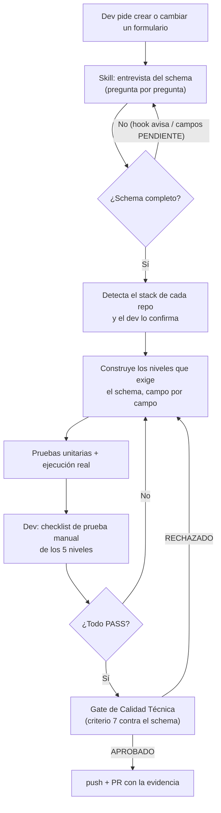

# PROTOCOLO DE VALIDACION DE FORMULARIOS

*Polaria | Técnico*

> **ESTADO DEL DOCUMENTO:** v1.1 en revisión (23/09/2026). La v1.0 aprobada el 14/09/2026 sigue siendo la publicada en Drive hasta que esta versión se apruebe.

## Glosario

| Término | Significado |
|---|---|
| Schema de campos | Archivo `schemas/schema_<formulario>.md` del repo de código con la ficha de cada campo: tipo, obligatorio, límites, mensaje de error, orden de tabulación, etc. Se llena con `PLANTILLA_SCHEMA_DE_CAMPOS_v1.1.md`. Todo lo que se construye sale de ahí. |
| Capas (Front / Back / BD) | Dónde se valida un campo: en el navegador (Front), en el servidor (Back) o en la base de datos (BD). El schema dice cuáles aplican a cada campo. |
| Niveles 1 a 5 | Las 5 validaciones que exige este protocolo, explicadas en la sección 6. |
| Stack | Las librerías que usa cada repo para validar (ej. hoy en Polaria: Zod en el front, class-validator en el back, Prisma en la BD). El protocolo no fija ninguna: la skill detecta la del repo. |
| Pre-llenado y Origen | Un campo que llega ya lleno. Su Origen es "Extracción IA", "Información de BD" o "Ambas". |
| Advertencia no-saltable | Aviso que impide Guardar/Continuar hasta que el usuario hace clic en un botón explícito de confirmación (ej. "Entendido, continuar"). No cumple: un aviso que desaparece solo ni uno que se cierra haciendo clic afuera. |
| Prueba de contrato | Prueba que manda el mismo valor límite a todas las capas de un campo y verifica que todas lo aceptan o lo rechazan igual. |
| Skill / hook / MCP | Piezas del flujo, explicadas en la sección 3. |

## 1. Contexto

Aplica a cualquier formulario nuevo o modificado, en cualquier proyecto de Polaria y con cualquier stack. Lo ejecuta un asistente de IA (Claude Code o Cursor) que construye la validación, con el Desarrollador supervisando y probando.

Nace de lo que aprendimos construyendo los primeros formularios de la plataforma: la validación que depende de que alguien se acuerde de cada detalle se queda corta. Cada regla de este protocolo convierte uno de esos aprendizajes en un paso que siempre se cumple: los tipos de dato, el orden de tabulación y el foco, los valores mínimos y las fechas, las advertencias cuando los datos pre-llenados no coinciden, y el cuidado de lo que el usuario ya capturó.

## 2. Objetivo

Que ningún formulario de Polaria permita guardar datos inválidos o inconsistentes, y que todos sigan el mismo flujo de foco y tabulación.

## 3. Cómo funciona (Pasos)

Lo ejecuta el plugin `validacion-formularios` (skill + hook), instalado en cada repo de código desde el marketplace `PolariaTech/polaria-agent-plugins` (Claude Code y Cursor), junto con el plugin del Gate y el MCP de Linear. En total, el flujo usa 4 piezas:

| Pieza | Qué hace |
|---|---|
| Skill `validacion-formularios-polaria` | Coordina todo el flujo: entrevista del schema, detección del stack, construcción de los 5 niveles, pruebas y checklist de prueba manual. |
| Hook del schema | Cada vez que la IA escribe un `schemas/schema_*.md`, avisa si quedó texto de plantilla entre corchetes (ej. `[Sí/No]`), para que no se construya sobre un schema incompleto. Requiere Node.js en la máquina del dev. |
| Gate de Calidad Técnica (plugin `gate-calidad-tecnica`) | Antes del `push`, su criterio 7 verifica que el cambio cumple el schema: niveles, pruebas, su ejecución y el checklist de prueba manual. |
| MCP de Linear | Publica la evidencia (salida de las pruebas y checklist manual) en el issue, siempre con confirmación del dev. |

**Paso 0 — Arranque.** El dev pide algo como *"hay que crear el formulario de X"*, *"agrega un campo a este formulario"* o *"valida este formulario"*, y la skill se activa sola.

**Paso 1 — Schema.** Antes de escribir código, la skill entrevista al dev pregunta por pregunta, con el guion de `PLANTILLA_SCHEMA_DE_CAMPOS_v1.1.md`, y nunca completa un valor sin su confirmación. Le muestra el archivo completo y lo guarda en `schemas/` solo cuando el dev lo aprueba; el hook avisa si quedó texto de plantilla. Si el formulario ya tenía schema, este declara en "Campos nuevos o modificados" cuáles cambian, y los Pasos 2 a 5 aplican solo a esos.

**Paso 2 — Stack.** La skill detecta, en cada repo, con qué librerías se valida: primero mira cómo validan los formularios que ya existen, después el manifiesto de dependencias (`package.json`, `pyproject.toml`, etc.). Le muestra al dev lo que encontró (ej. "Front: Zod · Back: class-validator · BD: Prisma") y espera su confirmación. Si no hay una señal clara, le pregunta.

**Paso 3 — Construcción.** La IA construye los niveles de la sección 6 que el schema exige para cada campo, con las librerías confirmadas en el Paso 2. Cada nivel se da por cerrado solo cuando cumple su columna "Listo cuando".

**Paso 4 — Pruebas.** La IA escribe las pruebas unitarias de la sección 7, con el runner que ya usa el repo, y las ejecuta. La salida real de la ejecución, no solo el código de las pruebas, queda como evidencia y se publica junto con el checklist del Paso 5.

**Paso 5 — Prueba manual.** La skill arma un checklist con los niveles que el schema exige, en las capas de este repo, aplicados a los campos del formulario. El dev prueba los Niveles 1 a 3 con teclado y navegador; los Niveles 4 y 5 se prueban con una petición directa al endpoint y un intento de escritura directa en la BD, citando la respuesta. La skill publica el checklist marcado y la salida de las pruebas en el issue de Linear, con confirmación del dev; si no hay issue, van en la descripción del PR del Paso 7.

| Resultado | Qué pasa |
|---|---|
| Todos los ítems en PASS | Sigue al Paso 6. |
| Algún ítem en FAIL | La IA corrige, vuelve a correr las pruebas del Paso 4 y el dev repite el ítem que falló. No se hace `push`. |

**Paso 6 — Gate.** El dev corre el Gate de Calidad Técnica. Su criterio 7 revisa el cambio contra el schema del Paso 1.

| Veredicto | Qué pasa |
|---|---|
| `APROBADO` | Sigue al Paso 7. |
| `RECHAZADO` | Se corrige desde el Paso 3, se repiten los Pasos 4 y 5 para lo que cambió y se vuelve a correr el Gate. |

**Paso 7 — Push y PR.** El dev hace `push` y abre el PR, con la evidencia de los Pasos 4 y 5 enlazada.

## 4. Reglas

| Regla | Por qué existe |
|---|---|
| No se escribe código de un formulario sin su schema completo y aprobado por el dev | Todo lo que se construye y se prueba sale del schema. Si la IA completa un valor por su cuenta, termina validando una regla que nadie pidió. |
| Cada campo se valida en las capas que dice su schema, y si le falta una capa, el schema lo justifica en "Notas y justificaciones" | Ninguna capa sola es suficiente: el navegador se puede saltar, y sin la barrera de BD un bug futuro del backend deja datos inválidos guardados. |
| Todo campo con capa Back se vuelve a validar en el servidor, sin excepción | El frontend se puede saltar con las herramientas del navegador o llamando directo a la API. Confiar solo en el cliente deja pasar exactamente los datos inválidos que este protocolo existe para frenar. |
| La IA usa el stack que ya tiene el repo y el dev lo confirma. No agrega una librería nueva si ya hay una que cumple esa función; si se necesita algo que ninguna cubre, la agrega y le dice al dev cuál y para qué | Dos librerías que hacen lo mismo dejan un formulario que nadie más sabe mantener. Prohibir cualquier librería nueva, en cambio, obliga a improvisar lo que una librería ya resuelve bien. |
| Un modal con datos sin guardar nunca se cierra por clic afuera | Caso real: un clic accidental afuera del modal borraba todo lo capturado. |
| Esc y Cancelar/Cerrar funcionan, pero con confirmación de descarte si hay datos sin guardar | Quitar Esc rompe la navegación por teclado (estándar WAI-ARIA); la confirmación evita la pérdida de datos. |
| Eliminar, y Cerrar/Cancelar con datos sin guardar, piden confirmación explícita. Guardar/Editar con éxito no la pide, solo muestra que se guardó | Son las únicas acciones que no se pueden deshacer. Si todo pide confirmación, el usuario la acepta por costumbre justo cuando importa. |
| Los campos deshabilitados nunca reciben foco | Caso real: confundía al usuario y rompía la navegación por teclado. |
| Pre-llenado con Origen "Ambas" y las dos fuentes no coinciden → estilo warning y advertencia no-saltable al continuar | Caso real: un formulario pre-llenado con IA y BD dejaba continuar sin avisar que los datos no coincidían. La advertencia hace que el usuario vea la diferencia y decida si sigue así. |
| Pre-llenado con Origen "Extracción IA" → estilo teal, siempre editable, y advertencia no-saltable que pide confirmar que se revisó | La IA puede equivocarse y no hay otra fuente con qué compararla: bloquear la edición dejaría el error sin forma de arreglarse. |
| Pre-llenado con Origen "Información de BD" → editable o solo lectura según lo que diga el schema para ese campo. La IA siempre lo pregunta en la entrevista y nunca asume solo lectura | Caso real: un precio venía de la BD y el negocio necesitaba poder modificarlo. Suponer solo lectura por defecto bloquea cambios legítimos. |
| Los colores warning, teal y danger se toman del sistema de diseño del proyecto, nunca de valores inventados | Si cada formulario usa sus propios colores, el usuario deja de reconocer qué significa cada estado. |
| Los niveles se pueden construir en paralelo, pero cada uno se cierra solo cuando cumple su "Listo cuando". Las pruebas empiezan cuando los niveles cierran, y la prueba manual cuando las pruebas pasan | Sin ese orden se puede dar un nivel por "hecho" sin verificarlo, y el hueco aparece en la prueba manual o en producción. |
| Si un formulario ya validado cambia solo algunos campos, los Pasos 2 a 5 aplican solo a los campos nuevos o modificados, con prueba de regresión dirigida (sección 7) | Aplicar todo el proceso a un cambio de 1 campo, en un equipo de 3 devs sin CI/CD, genera tanta fricción que incentiva saltarse pasos. |
| Ningún formulario llega a producción sin todos los niveles que su schema exige, en todas sus capas. No hay excepción por urgencia | Un formulario a medio validar en producción es exactamente lo que este protocolo existe para evitar. Si no alcanza el tiempo, se posterga el despliegue, no la validación. |

## 5. Excepciones

| Situación | Qué hacer |
|---|---|
| El backend no responde al validar | Se espera un máximo de 15 s y se muestra "No se pudo validar la información. Reintentar." con opción de reintentar. Los datos capturados se quedan en el formulario; nunca se asume éxito sin una respuesta 2xx real. |
| El dev no puede completar el schema en el momento | Se pausa: no se pasa al Paso 2. El schema se guarda con cada dato faltante marcado `PENDIENTE`. |
| El frontend y el backend viven en repos distintos | El schema vive en `schemas/` del repo donde está el formulario. En el otro repo, la skill lo busca primero entre las carpetas del workspace (empezando por el repo de flujos, el que tiene `flujo` en el nombre) y, si no lo encuentra, lo lee de la ruta que dé el dev o del issue de Linear. Cada repo construye y prueba solo sus capas. La prueba de contrato se hace en cada repo con el mismo valor límite del schema. |
| Se descubre en producción un campo sin las capas que su schema pedía | Se trata como hallazgo por severidad: **Crítico** (afecta precio, cobro o pérdida irreversible de datos) → hotfix en ≤24 h; **Alto** (dato inconsistente pero recuperable a mano) → ≤5 días hábiles; **Medio/Bajo** (cosmético) → siguiente sprint. Siempre se corrige con este protocolo y con una prueba de regresión de ese caso. |

## 6. Los 5 niveles

Cada nivel aplica solo a los campos cuyo schema lo pide. La forma exacta de construirlo con cada librería vive en la skill.

| Nivel | Capa | Qué exige | Listo cuando |
|---|---|---|---|
| 1. Tipo y formato | Front | El campo bloquea el carácter inválido mientras se escribe, no solo al enviar. | Ningún campo acepta un carácter fuera de su tipo al escribir directamente en él. |
| 2. Interacción | Front | Orden de tabulación y foco automático de la Tabla 2; deshabilitados fuera del orden de tabulación; reglas de modal, confirmaciones y pre-llenado de la sección 4. | La tabulación sigue el schema, los deshabilitados nunca reciben foco, y el modal, las confirmaciones y el pre-llenado se comportan como dice la sección 4. |
| 3. Reglas de negocio | Front | Obligatorios, límites, valor por defecto válido y dependencias entre campos de la Tabla 1, validados al salir del campo y otra vez al enviar. Cada error muestra el mensaje exacto del schema en estilo danger y lleva el foco al primer campo con error. | Guardar queda bloqueado mientras exista un error, y el usuario ve exactamente qué corregir. |
| 4. Backend | Back | Las mismas reglas de los Niveles 1 y 3, repetidas en el servidor. | Una petición directa al endpoint con un valor inválido se rechaza con un código 4xx y el mismo mensaje del schema. Si el servidor no responde, el formulario se comporta como dice la Excepción 1. |
| 5. Base de datos | BD | Tipo de columna, obligatoriedad y unicidad como restricciones de la base de datos, más restricciones nativas del motor (ej. `CHECK`) donde la herramienta de esquema no alcance, en el esquema o en una migración versionada. | Escribir directo en la BD un valor que viola una restricción es rechazado. |

## 7. Pruebas unitarias

Patrón AAA (preparar, ejecutar, verificar), una verificación por prueba, nombre `{campo}_{escenario}_{resultado_esperado}`. Por cada campo del schema y cada capa Front y Back que tenga:

- 1 caso válido, 1 por cada valor límite y 1 por cada tipo de valor inválido.
- 1 caso por cada dependencia con otro campo, cumplida y violada.
- Campos de selección: 1 por cada opción válida y 1 con un valor fuera de las opciones.
- Dependencias entre fechas: 1 en el límite exacto, 1 antes y 1 después.
- Si el campo tiene más de una capa: 1 prueba de contrato con el mismo valor límite en todas.

El Nivel 2 no se prueba con pruebas unitarias: lo cubre la prueba manual del Paso 5.

Si solo cambian algunos campos de un formulario ya validado, las pruebas nuevas cubren esos campos, y se vuelven a correr las pruebas que ya existían del formulario para confirmar que no se rompió nada (prueba de regresión dirigida).

## Herramientas

| Herramienta | Para qué se usa | Quién necesita acceso |
|---|---|---|
| Librerías de validación del repo (las detecta la skill; hoy en Polaria: Zod, class-validator + class-transformer, Prisma sobre Postgres) | Construir los Niveles 1 a 5 | Desarrollador, asistente de IA |
| Runner de pruebas del repo | Pruebas unitarias y su ejecución (Paso 4) | Desarrollador, asistente de IA |

## Rollback

Si una validación ya desplegada rompe algo en producción, se revierte el despliegue siguiendo `ADENDA_VERSIONAMIENTO_EXCEPCIONES_Y_ROLLBACK_v1.1.md`.

## Métricas de éxito

| Métrica | Indicador de éxito |
|---|---|
| Cambios con formulario que el Gate de Calidad Técnica rechaza por el criterio 7 | Tendencia a la baja |
| Incidentes en producción por falta de validación | 0 |

## Dependencias

| Protocolo | Cuándo se activa |
|---|---|
| `GATE_DE_CALIDAD_TECNICA_PRE_MERGE_v1.2.md` | Siempre, antes del `push` de un cambio que crea o modifica un formulario (criterio 7). |
| `ADENDA_VERSIONAMIENTO_EXCEPCIONES_Y_ROLLBACK_v1.1.md` | Cuando hay que revertir una validación desplegada. |
| `SPEC_AUTOMATIZACION_VALIDACION_FORMULARIOS_N8N_v1.0.md` | Spec para automatizar la prueba manual del Paso 5. Todavía no está construida, así que ese paso sigue siendo manual. |

## Versión y revisión

v1.1 · pendiente de aprobación · Responsable Técnico · próxima revisión: cada 6 meses, o antes si cambia la forma de construir formularios en Polaria

_Historial: v1.0 (14/09/2026) con el stack fijo en Next.js/NestJS/Prisma y la revisión final en "Revisión de Pares". v1.1 (23/09/2026): se ejecuta con el plugin `validacion-formularios` (skill + hook del schema), sirve para cualquier stack (la skill detecta las librerías de cada repo y el dev las confirma), la revisión final pasa al Gate de Calidad Técnica antes del `push`, y el documento pasa al formato "Cómo funciona". Ajuste del 24/09/2026 (plugin 1.2.0): si el repo no tiene el schema, la skill lo busca en el repo de flujos y en las demás carpetas del workspace antes de entrevistar al dev, para no crear un schema duplicado._
